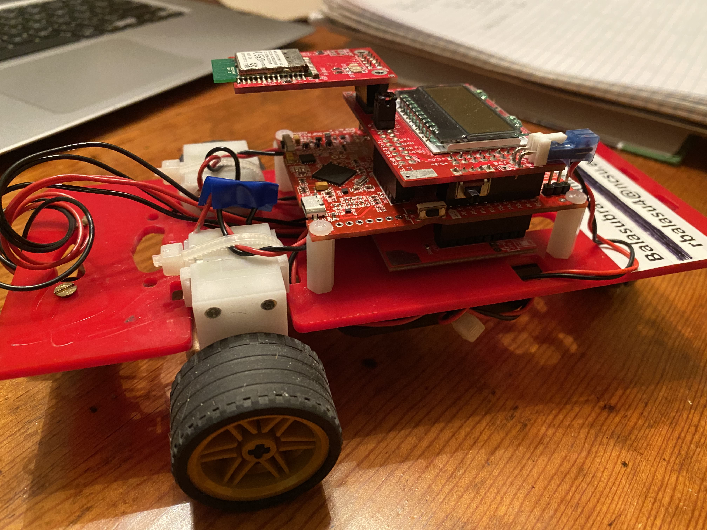
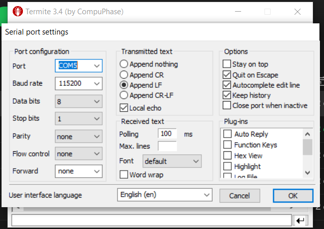
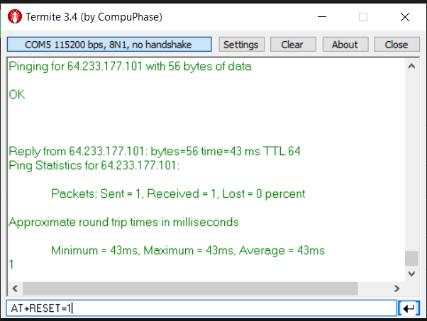
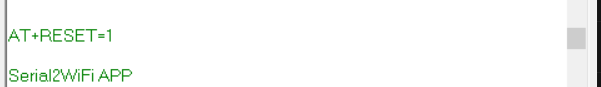
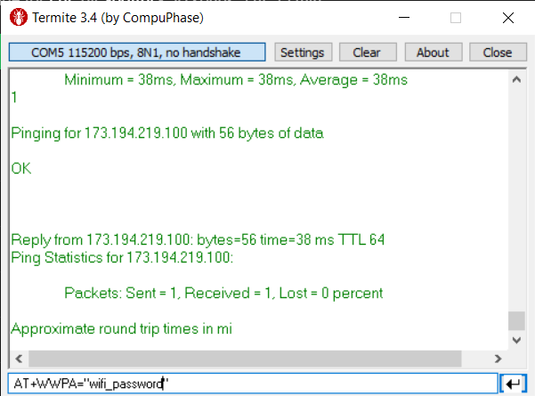
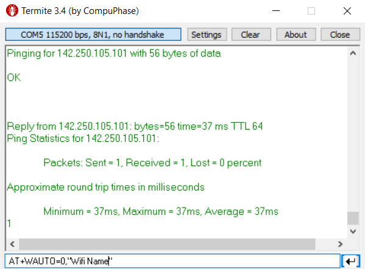
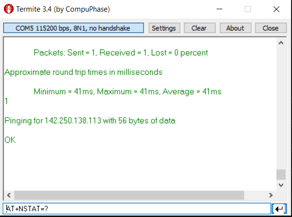
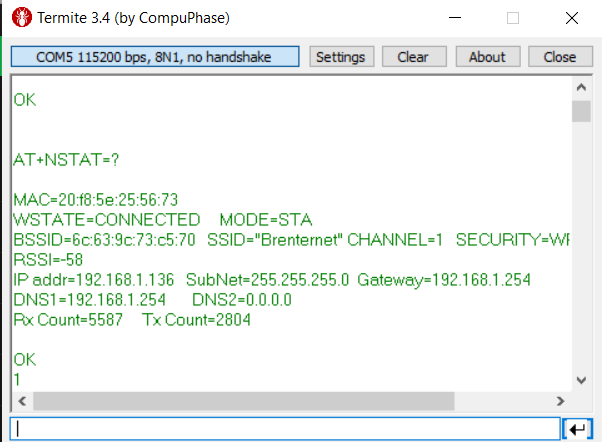
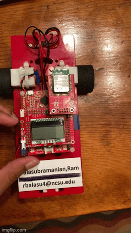
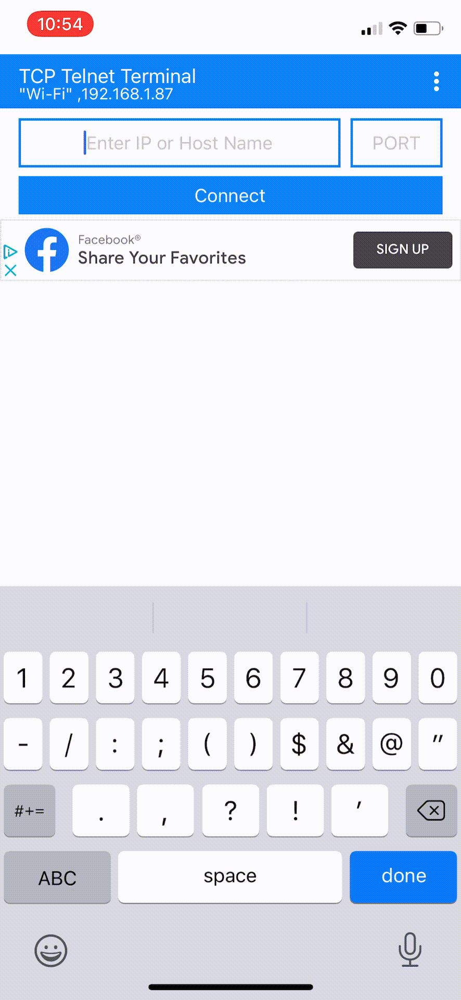

# iot-vehicle
Programmed TI MSP430FR2355 microcontroller using Embedded C to build a remote car with functionality to be controlled through your phone or laptop using the GS2101MIP Wi-Fi Module to send and receive information.

## Images of the infamous speed demon

# Instruction Manual
## Step 1. Connecting to WiFi
Download a RS232 Terminal that can be used for serial and TCP communications in order to send information to the WiFi module and set up the connection. I am using an application named Termite that you can download for free online, but feel free to use whatever you please.

Note: The code is set to keep pinging google.com in order to maintain the connection and lessens chances of the connection being weakened/disconnected. This causes the terminal window to stay populated with the results from the ping, do not be alarmed, that is normal.

### Termite Baud Rate Settings

### Reset module

### Reset command expected result

### Enter WiFi password

### Enter WiFi name

### Reset one more time

### Use NSTAT command to check connection

## Step 2. Turning power on
The code is setup so that once you have connected to WiFi, the next time you turn the car on it will automatically initialize the port information and siplay the IP address on the screen. The port is now set to "1236" in the code and can always be changed to a 4-digit number of your choosing. 

## Step 3. Connecting to vehic le through phone
The application I use (and recommend) to communicate with the vehicle is called TCP Telnet Terminal. You can use any terminal emulator for your phone or device as long as it has TCP/IP protocol functionality. Once you are connected, you should be able to send information to the IoT module that will then convey the commands to the board to be interpreted. 

## Step 4. Know the commands
The structure of the command is as follows: $\[4 digit pin\]\[direction command\]\[duration in seconds\]
The pin I currently have is 1212. Once again, this can be modified in the code. The command is structured this way for safety reasons so the board is looking for something specific and therefore cannot be easily manipulated to do something else. 

The four avaiable direction commands are:
- F : Forward
- R : Right
- L : Left
- B : Backward/Reverse

So for example, if you wanted to make the car go forward for 5 seconds, you would send: $1212F5

## Step 5. Have fun!
The TCP Telnet Terminal app lets you have programmed buttons that send a ready command. I have mine configured for the Forward, Right, Left, and Backward commands. This way I can control the direction with the touch of a button instead of typing out the command each time \(As you can see in the video\).

